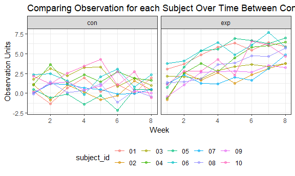

HW5
================
Jianyou Liu
November 6, 2018

Problem 1
---------

### Create tidy dataframe

#### Generate dataframe containing all file names

``` r
# Create dataframe containing all 20 file names in the directory
file_df = tibble(
  list.files(path = ".//data", all.files = FALSE)) 
  
names(file_df)[1] = "file_name"

file_df
```

    ## # A tibble: 20 x 1
    ##    file_name 
    ##    <chr>     
    ##  1 con_01.csv
    ##  2 con_02.csv
    ##  3 con_03.csv
    ##  4 con_04.csv
    ##  5 con_05.csv
    ##  6 con_06.csv
    ##  7 con_07.csv
    ##  8 con_08.csv
    ##  9 con_09.csv
    ## 10 con_10.csv
    ## 11 exp_01.csv
    ## 12 exp_02.csv
    ## 13 exp_03.csv
    ## 14 exp_04.csv
    ## 15 exp_05.csv
    ## 16 exp_06.csv
    ## 17 exp_07.csv
    ## 18 exp_08.csv
    ## 19 exp_09.csv
    ## 20 exp_10.csv

#### Iterate over file names and load data for each subject as nested list columns

``` r
#  Read in observation data for each subject as list columns
combine_df = 
  file_df %>%
  mutate(file_path = paste(".//data//", file_name, sep = "")) %>% 
  mutate(data = map(.x = file_path, ~read_csv(file = .x)))
```

    ## Parsed with column specification:
    ## cols(
    ##   week_1 = col_double(),
    ##   week_2 = col_double(),
    ##   week_3 = col_double(),
    ##   week_4 = col_double(),
    ##   week_5 = col_double(),
    ##   week_6 = col_double(),
    ##   week_7 = col_double(),
    ##   week_8 = col_double()
    ## )
    ## Parsed with column specification:
    ## cols(
    ##   week_1 = col_double(),
    ##   week_2 = col_double(),
    ##   week_3 = col_double(),
    ##   week_4 = col_double(),
    ##   week_5 = col_double(),
    ##   week_6 = col_double(),
    ##   week_7 = col_double(),
    ##   week_8 = col_double()
    ## )
    ## Parsed with column specification:
    ## cols(
    ##   week_1 = col_double(),
    ##   week_2 = col_double(),
    ##   week_3 = col_double(),
    ##   week_4 = col_double(),
    ##   week_5 = col_double(),
    ##   week_6 = col_double(),
    ##   week_7 = col_double(),
    ##   week_8 = col_double()
    ## )
    ## Parsed with column specification:
    ## cols(
    ##   week_1 = col_double(),
    ##   week_2 = col_double(),
    ##   week_3 = col_double(),
    ##   week_4 = col_double(),
    ##   week_5 = col_double(),
    ##   week_6 = col_double(),
    ##   week_7 = col_double(),
    ##   week_8 = col_double()
    ## )
    ## Parsed with column specification:
    ## cols(
    ##   week_1 = col_double(),
    ##   week_2 = col_double(),
    ##   week_3 = col_double(),
    ##   week_4 = col_double(),
    ##   week_5 = col_double(),
    ##   week_6 = col_double(),
    ##   week_7 = col_double(),
    ##   week_8 = col_double()
    ## )
    ## Parsed with column specification:
    ## cols(
    ##   week_1 = col_double(),
    ##   week_2 = col_double(),
    ##   week_3 = col_double(),
    ##   week_4 = col_double(),
    ##   week_5 = col_double(),
    ##   week_6 = col_double(),
    ##   week_7 = col_double(),
    ##   week_8 = col_double()
    ## )
    ## Parsed with column specification:
    ## cols(
    ##   week_1 = col_double(),
    ##   week_2 = col_double(),
    ##   week_3 = col_double(),
    ##   week_4 = col_double(),
    ##   week_5 = col_double(),
    ##   week_6 = col_double(),
    ##   week_7 = col_double(),
    ##   week_8 = col_double()
    ## )
    ## Parsed with column specification:
    ## cols(
    ##   week_1 = col_double(),
    ##   week_2 = col_double(),
    ##   week_3 = col_double(),
    ##   week_4 = col_double(),
    ##   week_5 = col_double(),
    ##   week_6 = col_double(),
    ##   week_7 = col_double(),
    ##   week_8 = col_double()
    ## )
    ## Parsed with column specification:
    ## cols(
    ##   week_1 = col_double(),
    ##   week_2 = col_double(),
    ##   week_3 = col_double(),
    ##   week_4 = col_double(),
    ##   week_5 = col_double(),
    ##   week_6 = col_double(),
    ##   week_7 = col_double(),
    ##   week_8 = col_double()
    ## )
    ## Parsed with column specification:
    ## cols(
    ##   week_1 = col_double(),
    ##   week_2 = col_double(),
    ##   week_3 = col_double(),
    ##   week_4 = col_double(),
    ##   week_5 = col_double(),
    ##   week_6 = col_double(),
    ##   week_7 = col_double(),
    ##   week_8 = col_double()
    ## )
    ## Parsed with column specification:
    ## cols(
    ##   week_1 = col_double(),
    ##   week_2 = col_double(),
    ##   week_3 = col_double(),
    ##   week_4 = col_double(),
    ##   week_5 = col_double(),
    ##   week_6 = col_double(),
    ##   week_7 = col_double(),
    ##   week_8 = col_double()
    ## )
    ## Parsed with column specification:
    ## cols(
    ##   week_1 = col_double(),
    ##   week_2 = col_double(),
    ##   week_3 = col_double(),
    ##   week_4 = col_double(),
    ##   week_5 = col_double(),
    ##   week_6 = col_double(),
    ##   week_7 = col_double(),
    ##   week_8 = col_double()
    ## )
    ## Parsed with column specification:
    ## cols(
    ##   week_1 = col_double(),
    ##   week_2 = col_double(),
    ##   week_3 = col_double(),
    ##   week_4 = col_double(),
    ##   week_5 = col_double(),
    ##   week_6 = col_double(),
    ##   week_7 = col_double(),
    ##   week_8 = col_double()
    ## )

    ## Parsed with column specification:
    ## cols(
    ##   week_1 = col_double(),
    ##   week_2 = col_double(),
    ##   week_3 = col_double(),
    ##   week_4 = col_double(),
    ##   week_5 = col_double(),
    ##   week_6 = col_double(),
    ##   week_7 = col_integer(),
    ##   week_8 = col_double()
    ## )

    ## Parsed with column specification:
    ## cols(
    ##   week_1 = col_double(),
    ##   week_2 = col_double(),
    ##   week_3 = col_double(),
    ##   week_4 = col_double(),
    ##   week_5 = col_double(),
    ##   week_6 = col_double(),
    ##   week_7 = col_double(),
    ##   week_8 = col_double()
    ## )
    ## Parsed with column specification:
    ## cols(
    ##   week_1 = col_double(),
    ##   week_2 = col_double(),
    ##   week_3 = col_double(),
    ##   week_4 = col_double(),
    ##   week_5 = col_double(),
    ##   week_6 = col_double(),
    ##   week_7 = col_double(),
    ##   week_8 = col_double()
    ## )
    ## Parsed with column specification:
    ## cols(
    ##   week_1 = col_double(),
    ##   week_2 = col_double(),
    ##   week_3 = col_double(),
    ##   week_4 = col_double(),
    ##   week_5 = col_double(),
    ##   week_6 = col_double(),
    ##   week_7 = col_double(),
    ##   week_8 = col_double()
    ## )
    ## Parsed with column specification:
    ## cols(
    ##   week_1 = col_double(),
    ##   week_2 = col_double(),
    ##   week_3 = col_double(),
    ##   week_4 = col_double(),
    ##   week_5 = col_double(),
    ##   week_6 = col_double(),
    ##   week_7 = col_double(),
    ##   week_8 = col_double()
    ## )
    ## Parsed with column specification:
    ## cols(
    ##   week_1 = col_double(),
    ##   week_2 = col_double(),
    ##   week_3 = col_double(),
    ##   week_4 = col_double(),
    ##   week_5 = col_double(),
    ##   week_6 = col_double(),
    ##   week_7 = col_double(),
    ##   week_8 = col_double()
    ## )
    ## Parsed with column specification:
    ## cols(
    ##   week_1 = col_double(),
    ##   week_2 = col_double(),
    ##   week_3 = col_double(),
    ##   week_4 = col_double(),
    ##   week_5 = col_double(),
    ##   week_6 = col_double(),
    ##   week_7 = col_double(),
    ##   week_8 = col_double()
    ## )

``` r
combine_df
```

    ## # A tibble: 20 x 3
    ##    file_name  file_path           data            
    ##    <chr>      <chr>               <list>          
    ##  1 con_01.csv .//data//con_01.csv <tibble [1 x 8]>
    ##  2 con_02.csv .//data//con_02.csv <tibble [1 x 8]>
    ##  3 con_03.csv .//data//con_03.csv <tibble [1 x 8]>
    ##  4 con_04.csv .//data//con_04.csv <tibble [1 x 8]>
    ##  5 con_05.csv .//data//con_05.csv <tibble [1 x 8]>
    ##  6 con_06.csv .//data//con_06.csv <tibble [1 x 8]>
    ##  7 con_07.csv .//data//con_07.csv <tibble [1 x 8]>
    ##  8 con_08.csv .//data//con_08.csv <tibble [1 x 8]>
    ##  9 con_09.csv .//data//con_09.csv <tibble [1 x 8]>
    ## 10 con_10.csv .//data//con_10.csv <tibble [1 x 8]>
    ## 11 exp_01.csv .//data//exp_01.csv <tibble [1 x 8]>
    ## 12 exp_02.csv .//data//exp_02.csv <tibble [1 x 8]>
    ## 13 exp_03.csv .//data//exp_03.csv <tibble [1 x 8]>
    ## 14 exp_04.csv .//data//exp_04.csv <tibble [1 x 8]>
    ## 15 exp_05.csv .//data//exp_05.csv <tibble [1 x 8]>
    ## 16 exp_06.csv .//data//exp_06.csv <tibble [1 x 8]>
    ## 17 exp_07.csv .//data//exp_07.csv <tibble [1 x 8]>
    ## 18 exp_08.csv .//data//exp_08.csv <tibble [1 x 8]>
    ## 19 exp_09.csv .//data//exp_09.csv <tibble [1 x 8]>
    ## 20 exp_10.csv .//data//exp_10.csv <tibble [1 x 8]>

#### Tidy resulting dataset

``` r
# Clean data for exploratory analysis
clean_df = combine_df %>% 
  mutate(file_name = str_replace(file_name, ".csv$", "")) %>% 
  separate(file_name, into = c("arm", "subject_id"), sep = "_") %>% 
  unnest() %>% 
  gather(key = week, value = observation, week_1:week_8) %>% 
  mutate(week = str_replace(week, "^week_", ""), week = as.numeric(week)) %>% 
  select(-file_path) %>% 
  arrange(arm, subject_id)

# First 10 rows of tidy dataset
print(clean_df, 10)
```

    ## # A tibble: 160 x 4
    ##    arm   subject_id  week observation
    ##    <chr> <chr>      <dbl>       <dbl>
    ##  1 con   01             1        0.2 
    ##  2 con   01             2       -1.31
    ##  3 con   01             3        0.66
    ##  4 con   01             4        1.96
    ##  5 con   01             5        0.23
    ##  6 con   01             6        1.09
    ##  7 con   01             7        0.05
    ##  8 con   01             8        1.94
    ##  9 con   02             1        1.13
    ## 10 con   02             2       -0.88
    ## # ... with 150 more rows

#### Plot observations on each subject over time

``` r
# Make spaghetti plot
clean_df %>% 
  ggplot(aes(x = week, y = observation, color = subject_id)) +
  geom_point(alpha = .5) + geom_line() +
  facet_grid(.~arm) +
  labs(
    title = "Comparing Observation for each Subject Over Time Between Control and Experimental Group",
    x = "Week",
    y = "Observation Units"
  )
```


