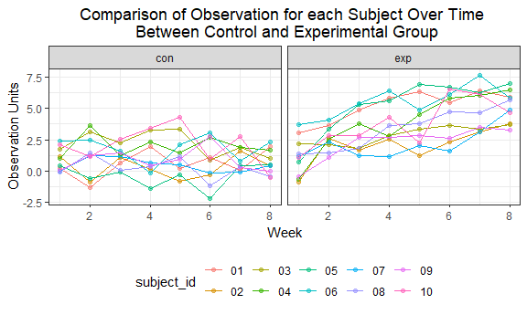

HW5
================
Jianyou Liu
November 6, 2018

Problem 1
---------

### Create tidy dataframe

#### Generate dataframe containing all file names

``` r
# Create dataframe containing all 20 file names in the directory
file_df = tibble(
  list.files(path = ".//data", all.files = FALSE)) 
  
names(file_df)[1] = "file_name"

file_df
```

    ## # A tibble: 20 x 1
    ##    file_name 
    ##    <chr>     
    ##  1 con_01.csv
    ##  2 con_02.csv
    ##  3 con_03.csv
    ##  4 con_04.csv
    ##  5 con_05.csv
    ##  6 con_06.csv
    ##  7 con_07.csv
    ##  8 con_08.csv
    ##  9 con_09.csv
    ## 10 con_10.csv
    ## 11 exp_01.csv
    ## 12 exp_02.csv
    ## 13 exp_03.csv
    ## 14 exp_04.csv
    ## 15 exp_05.csv
    ## 16 exp_06.csv
    ## 17 exp_07.csv
    ## 18 exp_08.csv
    ## 19 exp_09.csv
    ## 20 exp_10.csv

#### Iterate over file names and load data for each subject as nested list columns

``` r
#  Read in observation data for each subject as list columns
combine_df = 
  file_df %>%
  mutate(file_path = paste(".//data//", file_name, sep = "")) %>% 
  mutate(data = map(.x = file_path, ~read_csv(file = .x)))
```

    ## Parsed with column specification:
    ## cols(
    ##   week_1 = col_double(),
    ##   week_2 = col_double(),
    ##   week_3 = col_double(),
    ##   week_4 = col_double(),
    ##   week_5 = col_double(),
    ##   week_6 = col_double(),
    ##   week_7 = col_double(),
    ##   week_8 = col_double()
    ## )
    ## Parsed with column specification:
    ## cols(
    ##   week_1 = col_double(),
    ##   week_2 = col_double(),
    ##   week_3 = col_double(),
    ##   week_4 = col_double(),
    ##   week_5 = col_double(),
    ##   week_6 = col_double(),
    ##   week_7 = col_double(),
    ##   week_8 = col_double()
    ## )
    ## Parsed with column specification:
    ## cols(
    ##   week_1 = col_double(),
    ##   week_2 = col_double(),
    ##   week_3 = col_double(),
    ##   week_4 = col_double(),
    ##   week_5 = col_double(),
    ##   week_6 = col_double(),
    ##   week_7 = col_double(),
    ##   week_8 = col_double()
    ## )
    ## Parsed with column specification:
    ## cols(
    ##   week_1 = col_double(),
    ##   week_2 = col_double(),
    ##   week_3 = col_double(),
    ##   week_4 = col_double(),
    ##   week_5 = col_double(),
    ##   week_6 = col_double(),
    ##   week_7 = col_double(),
    ##   week_8 = col_double()
    ## )
    ## Parsed with column specification:
    ## cols(
    ##   week_1 = col_double(),
    ##   week_2 = col_double(),
    ##   week_3 = col_double(),
    ##   week_4 = col_double(),
    ##   week_5 = col_double(),
    ##   week_6 = col_double(),
    ##   week_7 = col_double(),
    ##   week_8 = col_double()
    ## )
    ## Parsed with column specification:
    ## cols(
    ##   week_1 = col_double(),
    ##   week_2 = col_double(),
    ##   week_3 = col_double(),
    ##   week_4 = col_double(),
    ##   week_5 = col_double(),
    ##   week_6 = col_double(),
    ##   week_7 = col_double(),
    ##   week_8 = col_double()
    ## )
    ## Parsed with column specification:
    ## cols(
    ##   week_1 = col_double(),
    ##   week_2 = col_double(),
    ##   week_3 = col_double(),
    ##   week_4 = col_double(),
    ##   week_5 = col_double(),
    ##   week_6 = col_double(),
    ##   week_7 = col_double(),
    ##   week_8 = col_double()
    ## )
    ## Parsed with column specification:
    ## cols(
    ##   week_1 = col_double(),
    ##   week_2 = col_double(),
    ##   week_3 = col_double(),
    ##   week_4 = col_double(),
    ##   week_5 = col_double(),
    ##   week_6 = col_double(),
    ##   week_7 = col_double(),
    ##   week_8 = col_double()
    ## )
    ## Parsed with column specification:
    ## cols(
    ##   week_1 = col_double(),
    ##   week_2 = col_double(),
    ##   week_3 = col_double(),
    ##   week_4 = col_double(),
    ##   week_5 = col_double(),
    ##   week_6 = col_double(),
    ##   week_7 = col_double(),
    ##   week_8 = col_double()
    ## )
    ## Parsed with column specification:
    ## cols(
    ##   week_1 = col_double(),
    ##   week_2 = col_double(),
    ##   week_3 = col_double(),
    ##   week_4 = col_double(),
    ##   week_5 = col_double(),
    ##   week_6 = col_double(),
    ##   week_7 = col_double(),
    ##   week_8 = col_double()
    ## )
    ## Parsed with column specification:
    ## cols(
    ##   week_1 = col_double(),
    ##   week_2 = col_double(),
    ##   week_3 = col_double(),
    ##   week_4 = col_double(),
    ##   week_5 = col_double(),
    ##   week_6 = col_double(),
    ##   week_7 = col_double(),
    ##   week_8 = col_double()
    ## )
    ## Parsed with column specification:
    ## cols(
    ##   week_1 = col_double(),
    ##   week_2 = col_double(),
    ##   week_3 = col_double(),
    ##   week_4 = col_double(),
    ##   week_5 = col_double(),
    ##   week_6 = col_double(),
    ##   week_7 = col_double(),
    ##   week_8 = col_double()
    ## )
    ## Parsed with column specification:
    ## cols(
    ##   week_1 = col_double(),
    ##   week_2 = col_double(),
    ##   week_3 = col_double(),
    ##   week_4 = col_double(),
    ##   week_5 = col_double(),
    ##   week_6 = col_double(),
    ##   week_7 = col_double(),
    ##   week_8 = col_double()
    ## )

    ## Parsed with column specification:
    ## cols(
    ##   week_1 = col_double(),
    ##   week_2 = col_double(),
    ##   week_3 = col_double(),
    ##   week_4 = col_double(),
    ##   week_5 = col_double(),
    ##   week_6 = col_double(),
    ##   week_7 = col_integer(),
    ##   week_8 = col_double()
    ## )

    ## Parsed with column specification:
    ## cols(
    ##   week_1 = col_double(),
    ##   week_2 = col_double(),
    ##   week_3 = col_double(),
    ##   week_4 = col_double(),
    ##   week_5 = col_double(),
    ##   week_6 = col_double(),
    ##   week_7 = col_double(),
    ##   week_8 = col_double()
    ## )
    ## Parsed with column specification:
    ## cols(
    ##   week_1 = col_double(),
    ##   week_2 = col_double(),
    ##   week_3 = col_double(),
    ##   week_4 = col_double(),
    ##   week_5 = col_double(),
    ##   week_6 = col_double(),
    ##   week_7 = col_double(),
    ##   week_8 = col_double()
    ## )
    ## Parsed with column specification:
    ## cols(
    ##   week_1 = col_double(),
    ##   week_2 = col_double(),
    ##   week_3 = col_double(),
    ##   week_4 = col_double(),
    ##   week_5 = col_double(),
    ##   week_6 = col_double(),
    ##   week_7 = col_double(),
    ##   week_8 = col_double()
    ## )
    ## Parsed with column specification:
    ## cols(
    ##   week_1 = col_double(),
    ##   week_2 = col_double(),
    ##   week_3 = col_double(),
    ##   week_4 = col_double(),
    ##   week_5 = col_double(),
    ##   week_6 = col_double(),
    ##   week_7 = col_double(),
    ##   week_8 = col_double()
    ## )
    ## Parsed with column specification:
    ## cols(
    ##   week_1 = col_double(),
    ##   week_2 = col_double(),
    ##   week_3 = col_double(),
    ##   week_4 = col_double(),
    ##   week_5 = col_double(),
    ##   week_6 = col_double(),
    ##   week_7 = col_double(),
    ##   week_8 = col_double()
    ## )
    ## Parsed with column specification:
    ## cols(
    ##   week_1 = col_double(),
    ##   week_2 = col_double(),
    ##   week_3 = col_double(),
    ##   week_4 = col_double(),
    ##   week_5 = col_double(),
    ##   week_6 = col_double(),
    ##   week_7 = col_double(),
    ##   week_8 = col_double()
    ## )

``` r
combine_df
```

    ## # A tibble: 20 x 3
    ##    file_name  file_path           data            
    ##    <chr>      <chr>               <list>          
    ##  1 con_01.csv .//data//con_01.csv <tibble [1 x 8]>
    ##  2 con_02.csv .//data//con_02.csv <tibble [1 x 8]>
    ##  3 con_03.csv .//data//con_03.csv <tibble [1 x 8]>
    ##  4 con_04.csv .//data//con_04.csv <tibble [1 x 8]>
    ##  5 con_05.csv .//data//con_05.csv <tibble [1 x 8]>
    ##  6 con_06.csv .//data//con_06.csv <tibble [1 x 8]>
    ##  7 con_07.csv .//data//con_07.csv <tibble [1 x 8]>
    ##  8 con_08.csv .//data//con_08.csv <tibble [1 x 8]>
    ##  9 con_09.csv .//data//con_09.csv <tibble [1 x 8]>
    ## 10 con_10.csv .//data//con_10.csv <tibble [1 x 8]>
    ## 11 exp_01.csv .//data//exp_01.csv <tibble [1 x 8]>
    ## 12 exp_02.csv .//data//exp_02.csv <tibble [1 x 8]>
    ## 13 exp_03.csv .//data//exp_03.csv <tibble [1 x 8]>
    ## 14 exp_04.csv .//data//exp_04.csv <tibble [1 x 8]>
    ## 15 exp_05.csv .//data//exp_05.csv <tibble [1 x 8]>
    ## 16 exp_06.csv .//data//exp_06.csv <tibble [1 x 8]>
    ## 17 exp_07.csv .//data//exp_07.csv <tibble [1 x 8]>
    ## 18 exp_08.csv .//data//exp_08.csv <tibble [1 x 8]>
    ## 19 exp_09.csv .//data//exp_09.csv <tibble [1 x 8]>
    ## 20 exp_10.csv .//data//exp_10.csv <tibble [1 x 8]>

#### Tidy resulting dataset

``` r
# Clean data for exploratory analysis
clean_df = combine_df %>% 
  mutate(file_name = str_replace(file_name, ".csv$", "")) %>% 
  separate(file_name, into = c("arm", "subject_id"), sep = "_") %>% 
  unnest() %>% 
  gather(key = week, value = observation, week_1:week_8) %>% 
  mutate(week = str_replace(week, "^week_", ""), week = as.numeric(week)) %>% 
  select(-file_path) %>% 
  arrange(arm, subject_id)

# First 10 rows of tidy dataset
print(clean_df, 10)
```

    ## # A tibble: 160 x 4
    ##    arm   subject_id  week observation
    ##    <chr> <chr>      <dbl>       <dbl>
    ##  1 con   01             1        0.2 
    ##  2 con   01             2       -1.31
    ##  3 con   01             3        0.66
    ##  4 con   01             4        1.96
    ##  5 con   01             5        0.23
    ##  6 con   01             6        1.09
    ##  7 con   01             7        0.05
    ##  8 con   01             8        1.94
    ##  9 con   02             1        1.13
    ## 10 con   02             2       -0.88
    ## # ... with 150 more rows

### Plot observations on each subject over time

``` r
# Make spaghetti plot
clean_df %>% 
  ggplot(aes(x = week, y = observation, color = subject_id)) +
  geom_point(alpha = .5) + geom_line() +
  facet_grid(.~arm) +
  labs(
    title = "Comparison of Observation for each Subject Over Time \n Between Control and Experimental Group",
    x = "Week",
    y = "Observation Units"
  ) +
  theme(plot.title = element_text(hjust = 0.5))
```



**Comment:** Overall, subjects in the experimental arm show higher observation units over time, on average, than those in the control arm. Moreover, observations for the subjects in the experimental group appears to be increasing over time; whereas no apparent pattern exists for the control group.

Problem 2
---------

### Read and describe raw data

``` r
raw_hom_data = read.csv("https://raw.githubusercontent.com/washingtonpost/data-homicides/master/homicide-data.csv")

head(raw_hom_data)
```

    ##          uid reported_date victim_last victim_first victim_race victim_age
    ## 1 Alb-000001      20100504      GARCIA         JUAN    Hispanic         78
    ## 2 Alb-000002      20100216     MONTOYA      CAMERON    Hispanic         17
    ## 3 Alb-000003      20100601 SATTERFIELD      VIVIANA       White         15
    ## 4 Alb-000004      20100101    MENDIOLA       CARLOS    Hispanic         32
    ## 5 Alb-000005      20100102        MULA       VIVIAN       White         72
    ## 6 Alb-000006      20100126        BOOK    GERALDINE       White         91
    ##   victim_sex        city state      lat       lon           disposition
    ## 1       Male Albuquerque    NM 35.09579 -106.5386 Closed without arrest
    ## 2       Male Albuquerque    NM 35.05681 -106.7153      Closed by arrest
    ## 3     Female Albuquerque    NM 35.08609 -106.6956 Closed without arrest
    ## 4       Male Albuquerque    NM 35.07849 -106.5561      Closed by arrest
    ## 5     Female Albuquerque    NM 35.13036 -106.5810 Closed without arrest
    ## 6     Female Albuquerque    NM 35.15111 -106.5378        Open/No arrest

The raw dataset is of size 52179, 12 with 52179 observations and 12 variables. Each observation/row represents a single criminal homicide inflicted to a victim. Some key variables include the geographic location of each case, whether an arrest was made, and basic demographic information about each victim.

#### Create city\_state variable and summarize total number of homicides as well as the number of unsolved ones.

``` r
# Merge city and state into one variable
new_hom_data = raw_hom_data %>% 
  unite(city, state, col = "city_state", sep = ",")

# Summarize within cities to find number of homicide 
tot_hom_data = new_hom_data %>% 
  group_by(city_state) %>% 
  summarize(total_homicide = n())

# Summarize within cities to find number of unsolved crimes
unsolv_hom_data = new_hom_data %>% 
  filter(disposition == "Closed without arrest" | disposition == "Open/No arrest") %>% 
  group_by(city_state) %>% 
  summarize(unsolved_homicides = n())
  
# Join datasets
city_hom_data = left_join(tot_hom_data, unsolv_hom_data, by = "city_state")

# First 10 rows of resulting dataset
print(city_hom_data, 10)
```

    ## # A tibble: 51 x 3
    ##    city_state     total_homicide unsolved_homicides
    ##    <chr>                   <int>              <int>
    ##  1 Albuquerque,NM            378                146
    ##  2 Atlanta,GA                973                373
    ##  3 Baltimore,MD             2827               1825
    ##  4 Baton Rouge,LA            424                196
    ##  5 Birmingham,AL             800                347
    ##  6 Boston,MA                 614                310
    ##  7 Buffalo,NY                521                319
    ##  8 Charlotte,NC              687                206
    ##  9 Chicago,IL               5535               4073
    ## 10 Cincinnati,OH             694                309
    ## # ... with 41 more rows

### Baltimore, MD Analysis

#### Estimate proportion and confidence intervals

``` r
# Run prop.test for Baltimore, MD
balt_prop_test = prop.test(1825, 2827, p = 0.5, conf.level = 0.95)
tidy_output = broom::tidy(balt_prop_test)
 
# Pull estimate and CI from resulting tidy dataframe
est_prop = pull(tidy_output, estimate)
low_CI = pull(tidy_output, conf.low)
high_CI = pull(tidy_output, conf.high)
```

According to the results of the test, the point estimate of the proportion of unsolved crimes in Baltimore, MD is 0.6455607; and we can be 95% confident that the true proportion of unsolved homicides in this city is between 0.6275625 and 0.6631599
